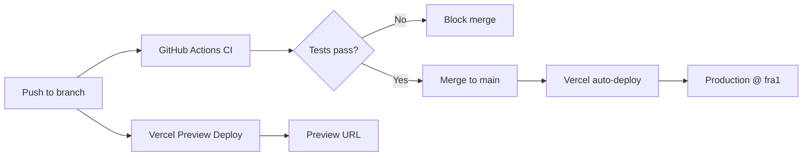

## Implementation Plan — Vercel Auto-Deploy for BarkBuddy

**Problem Statement:**
BarkBuddy has been deployed once via CLI (`vercel --prod`) and has a CI workflow, but needs a verified, repeatable auto-deploy pipeline where pushing to `main` automatically deploys to production on Vercel with the correct region (`fra1`) and no manual intervention.

**Requirements:**
- Auto-deploy on merge to `main` via Vercel GitHub Integration (already connected)
- Function region set to `fra1` (Frankfurt) for Polish users
- GitHub Actions CI kept as quality gate (lint → test → build)
- No Supabase or environment variables needed yet
- Verify the full flow works end-to-end

**Background:**
- Project is already linked to Vercel (`prj_w2tQE9ERyTBkacuE8UoYAMNVpBPy`)
- `vercel.json` already has `"regions": ["fra1"]`
- CI workflow already runs on push/PR to `main`
- Production URL: `https://bark-buddy-rose.vercel.app`
- GitHub repo: `karolwasemann/bark-buddy`

**Proposed Solution:**
Verify the existing setup works end-to-end, add a deploy verification test, and document the workflow so future pushes "just work."

**Architecture:**


**Task Breakdown:**

**Task 1: Save this deployment plan to `context/deployment/deployment-plan.md`**
- **Objective:** Persist the full plan as a markdown file in the project's context directory.

**Task 2: Verify Vercel GitHub Integration is active**
- **Objective:** Confirm that the Vercel GitHub Integration is connected to `karolwasemann/bark-buddy` and auto-deploys are enabled.
- **Test:** Confirm `vercel ls` shows at least one deployment with source `github`.

**Task 3: Verify `fra1` region configuration is applied**
- **Objective:** Confirm that deployed functions execute in Frankfurt (`fra1`), not the default US East.
- **Test:** `vercel inspect` on the latest production deployment shows `fra1` as the function region.

**Task 4: Trigger an end-to-end auto-deploy via git push**
- **Objective:** Push a small, verifiable change to `main` and confirm the full pipeline works: CI passes → Vercel auto-deploys → production URL reflects the change.
- **Test requirements:**
  - CI workflow passes (lint, test, build)
  - Vercel preview deploy is created for the PR
  - After merge, production URL (`bark-buddy-rose.vercel.app`) reflects the change

**Task 5: Add branch protection rule requiring CI to pass before merge**
- **Objective:** Ensure no code reaches `main` without passing lint + test + build.
- **Implementation:** GitHub repo Settings → Branches → Branch protection rule for `main` → Require status checks → add `ci` job.

**Task 6: Document the deploy workflow**
- **Objective:** Create `context/deployment/deploy-workflow.md` covering deploy, preview, rollback, region, CI gate, and known limitations.

---

## External Services Configuration Plan

### Services Required (from PRD + tech-stack)

| Service | Purpose | PRD Requirement |
|---------|---------|-----------------|
| **Supabase Auth** | Email+password registration & login | FR-001, FR-002 |
| **Supabase PostgreSQL + PostGIS** | User/dog profiles, walking-area pins, circle-overlap matching | FR-003–FR-007, Business Logic |
| **Supabase Storage** | Dog photo uploads | FR-011 |
| **Map tile provider** | Interactive map for pin placement + radius | FR-005 |

### Task 7: Create Supabase project ✅

- **Status:** Done
- **Project URL:** `https://eaqlxszvkjgqrghcxxlx.supabase.co`
- **Region:** EU West (Frankfurt) — co-located with Vercel fra1

### Task 8: Configure Supabase Auth (email+password) ✅

- **Status:** Done
- Email provider enabled, confirm email disabled
- Site URL: `https://bark-buddy-rose.vercel.app`
- Redirect URLs: localhost, production, preview deploys

### Task 9: Set up Supabase database schema (PostGIS)

- **Status:** Deferred — will create tables when implementing features
- PostGIS extension + tables (profiles, dogs, walking_areas) to be created during feature implementation

### Task 10: Configure Supabase Storage (dog photos) ✅

- **Status:** Done
- Bucket: `dog-photos`, private, 5MB limit, jpeg/png/webp
- Upload policy: user's own folder only
- Read policy: all authenticated users

### Task 11: Wire Supabase environment variables into Vercel ✅

- **Status:** Done
- `NEXT_PUBLIC_SUPABASE_URL` — Production, Preview, Development
- `NEXT_PUBLIC_SUPABASE_ANON_KEY` — Production, Preview, Development
- `.env.local` created for local dev (gitignored)

### Task 12: Install Supabase client library ✅

- **Status:** Done
- `@supabase/supabase-js@2.106.2` + `@supabase/ssr@0`
- `src/lib/supabase/client.ts` — browser client
- `src/lib/supabase/server.ts` — server components client

### Task 13: Choose and configure map tile provider

- **Status:** Deferred — will choose during map feature implementation

### Environment Variables Summary

| Variable | Scope | Source |
|----------|-------|--------|
| `NEXT_PUBLIC_SUPABASE_URL` | Client + Server | Supabase Dashboard → Settings → API |
| `NEXT_PUBLIC_SUPABASE_ANON_KEY` | Client + Server | Supabase Dashboard → Settings → API |
| `SUPABASE_SERVICE_ROLE_KEY` | Server only | Supabase Dashboard → Settings → API |
| `NEXT_PUBLIC_MAPBOX_TOKEN` | Client (only if Mapbox) | Mapbox account → Access tokens |

### Execution Order

```
Task 7 (create Supabase project)
  → Task 8 (configure auth)
  → Task 9 (database schema + PostGIS)
  → Task 10 (storage bucket)
  → Task 11 (wire env vars to Vercel)
  → Task 12 (install client library)
  → Task 13 (map provider)
```

Tasks 7–10 are manual (Supabase dashboard). Tasks 11–13 are automatable by the agent once credentials are available.
