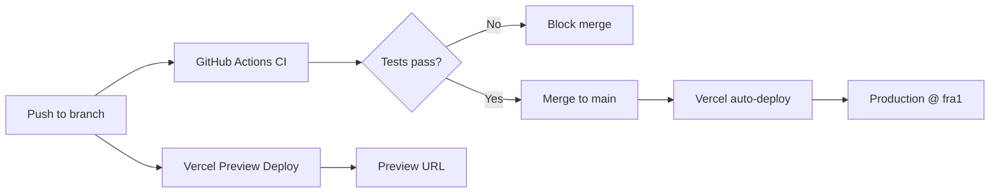

## Implementation Plan — Vercel Auto-Deploy for BarkBuddy

**Problem Statement:**
BarkBuddy has been deployed once via CLI (`vercel --prod`) and has a CI workflow, but needs a verified, repeatable auto-deploy pipeline where pushing to `main` automatically deploys to production on Vercel with the correct region (`fra1`) and no manual intervention.

**Requirements:**
- Auto-deploy on merge to `main` via Vercel GitHub Integration (already connected)
- Function region set to `fra1` (Frankfurt) for Polish users
- GitHub Actions CI kept as quality gate (lint → test → build)
- No Supabase or environment variables needed yet
- Verify the full flow works end-to-end

**Background:**
- Project is already linked to Vercel (`prj_w2tQE9ERyTBkacuE8UoYAMNVpBPy`)
- `vercel.json` already has `"regions": ["fra1"]`
- CI workflow already runs on push/PR to `main`
- Production URL: `https://bark-buddy-rose.vercel.app`
- GitHub repo: `karolwasemann/bark-buddy`

**Proposed Solution:**
Verify the existing setup works end-to-end, add a deploy verification test, and document the workflow so future pushes "just work."

**Architecture:**

**Task Breakdown:**

**Task 1: Save this deployment plan to `context/deployment/deployment-plan.md`**
- **Objective:** Persist the full plan as a markdown file in the project's context directory.

**Task 2: Verify Vercel GitHub Integration is active**
- **Objective:** Confirm that the Vercel GitHub Integration is connected to `karolwasemann/bark-buddy` and auto-deploys are enabled.
- **Test:** Confirm `vercel ls` shows at least one deployment with source `github`.

**Task 3: Verify `fra1` region configuration is applied**
- **Objective:** Confirm that deployed functions execute in Frankfurt (`fra1`), not the default US East.
- **Test:** `vercel inspect` on the latest production deployment shows `fra1` as the function region.

**Task 4: Trigger an end-to-end auto-deploy via git push**
- **Objective:** Push a small, verifiable change to `main` and confirm the full pipeline works: CI passes → Vercel auto-deploys → production URL reflects the change.
- **Test requirements:**
  - CI workflow passes (lint, test, build)
  - Vercel preview deploy is created for the PR
  - After merge, production URL (`bark-buddy-rose.vercel.app`) reflects the change

**Task 5: Add branch protection rule requiring CI to pass before merge**
- **Objective:** Ensure no code reaches `main` without passing lint + test + build.
- **Implementation:** GitHub repo Settings → Branches → Branch protection rule for `main` → Require status checks → add `ci` job.

**Task 6: Document the deploy workflow**
- **Objective:** Create `context/deployment/deploy-workflow.md` covering deploy, preview, rollback, region, CI gate, and known limitations.
